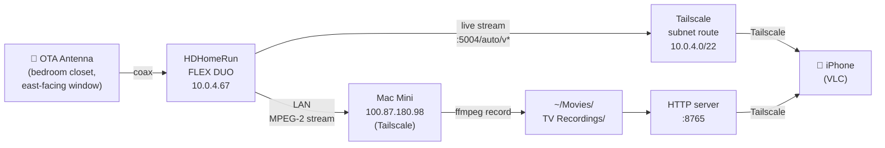

My TV antenna lived behind my TV in the living room. It worked well enough when nothing was in the way, but the reception was inconsistent. If someone walked between the antenna and the window, the signal dropped. If I forgot to pull it out and angle it before sitting down, I got nothing. It was annoying enough that I mostly ignored the TV and used streaming instead.

I had an HDHomeRun FLEX DUO from a previous place where I had the antenna setup dialed in. I moved and never got around to setting it up again at the new apartment. This week I finally did.

---

## Moving the Antenna

The fix was straightforward: move the antenna somewhere it would not get shadowed. I put it in my bedroom closet. There is a small east-facing window in there, which is unusual for a closet, but it turned out to be exactly what I needed. The antenna faces east and does not move.

Signal improved significantly. The scan I ran after moving it found 15+ locked channels with strong signal. KPYX-DT on UHF 557 MHz came in at ss=97/snq=100. KGO ABC locked at ss=97. KNTV NBC at ss=95. Reception is consistent now regardless of what is happening in the living room.

---

## The HDHomeRun Setup

The HDHomeRun FLEX DUO (model HDFX-2US) sits on the network and streams to anything that can reach it over HTTP. Device discovery works fine on the local network. The device showed up at `10.0.4.67` and has a simple REST API:

```
GET http://10.0.4.67/discover.json     # device info
GET http://10.0.4.67/lineup.json       # channel list with stream URLs
```

Each channel in the lineup has a direct stream URL in the format:

```
http://10.0.4.67:5004/auto/v[channel]
```

So KTVU Fox 2 is `http://10.0.4.67:5004/auto/v2.1`, KGO ABC 7 is `http://10.0.4.67:5004/auto/v7.1`, and so on.

Here is the full system layout:



---

## Remote Access via Tailscale

The HDHomeRun app uses UDP broadcast to discover devices on the local network. That does not work over a VPN, so the app shows nothing when you are away from home.

The fix: enable Tailscale subnet routing on the Mac mini so the whole local subnet is reachable remotely.

```bash
tailscale set --advertise-routes=10.0.4.0/22
```

Then approve the route in the Tailscale admin console (tailscale.com/admin, Machines, Edit route settings). On the remote device, make sure "Accept routes" is on in the Tailscale app.

After that, `10.0.4.67` is reachable from anywhere on the tailnet. The HDHomeRun app still will not auto-discover it (broadcast still does not work), but the stream URLs work directly.

---

## Watching Live TV Remotely

The HDHomeRun app is not the right tool for remote access. VLC is. Open VLC on iOS, go to Network, and enter a stream URL:

```
http://10.0.4.67:5004/auto/v7.1    # KGO ABC
http://10.0.4.67:5004/auto/v5.1    # KPIX CBS
http://10.0.4.67:5004/auto/v2.1    # KTVU Fox
http://10.0.4.67:5004/auto/v9.1    # KQED PBS
http://10.0.4.67:5004/auto/v11.1   # KNTV NBC
```

It works over Tailscale from anywhere with cell or WiFi. The stream is raw MPEG-2 from the tuner, so there is no re-encoding happening on the Mac side.

---

## Recording with ffmpeg

Recording is a single ffmpeg command. The HDHomeRun does the tuning, ffmpeg pulls the stream and writes to a file. No subscriptions, no guide data needed.

```bash
ffmpeg -i http://10.0.4.67:5004/auto/v7.1 -t 3600 -c copy kgo_abc.mkv
```

The `-c copy` flag is important: it passes the MPEG-2 video and AC3 audio through without re-encoding. The Mac is not doing any transcoding work, just copying bytes from the network to disk.

I wrapped this in a small Python script that handles duration parsing, auto-naming by date and channel, and a channel map so I can use numbers instead of stream URLs:

```bash
python3 ~/Code/Dex/tools/hdhr_record.py 7.1 1h     # record KGO for 1 hour
python3 ~/Code/Dex/tools/hdhr_record.py 2.1 2h30m  # record Fox for 2.5 hours
```

Files go to `~/Movies/TV Recordings/` named by date, time, and channel.

Since it is just a shell command at heart, it works directly with cron. To record the evening news every weeknight:

```
0 18 * * 1-5 python3 ~/Code/Dex/tools/hdhr_record.py 7.1 30m
```

No guide integration needed if you know the schedule. Cron handles the rest.

To make recordings accessible remotely, a one-liner HTTP server on the Mac serves the directory:

```bash
cd ~/Movies/TV\ Recordings && python3 -m http.server 8765
```

Then in VLC on iOS, the URL is `http://100.87.180.98:8765/[filename].mkv` where `100.87.180.98` is the Mac's Tailscale IP.

---

## First Real Test: FIFA World Cup from the Airport and a Plane

The day I got this working, I was flying home from a trip. I watched the World Cup on my phone from the airport departure lounge and then on the plane, streamed live from the tuner back home over Tailscale. Without this setup, I would have needed a cable TV subscription or a paid streaming service to watch it. Instead it was free, using an antenna I already owned.

That said, airport WiFi and airplane connectivity are the worst-case scenario for live streaming. The feed dropped frames constantly. On the ground at the gate it was watchable but choppy. On the plane it was borderline. The content was there but the picture kept locking up.

This is not a problem with the HDHomeRun or the antenna or the Tailscale routing. It is the right expectation to set: live streaming at 5+ Mbps over a congested shared network is going to struggle. The system held up fine. The network was the constraint.

---

## Why Recorded Playback Looks Better Than Live Streaming

The airport experience made the recording quality difference obvious. The recorded MKV plays noticeably cleaner than the same content streamed live, even though the underlying signal is identical.

The reason is macroblocking. Live streaming over a network with any packet loss or congestion causes the MPEG-2 decoder to fill in missing data with whatever it has, which produces the familiar blocky artifact where a 16x16 pixel block freezes or smears. The decoder has no way to go back and fix it. On airport WiFi this happens constantly.

When you play a recording, the full stream is already on disk. The player buffers ahead freely with no network dependency during playback. Missing packets cannot happen because there are no packets, only file reads. The result is that even a stream that would produce macroblocking at 5 Mbps live plays cleanly as a file.

It is not that the source quality is better. It is that file I/O is more reliable than real-time network delivery over a stressed connection. For a stable home network, the live stream is fine. For an airport or a plane, record first and play back the file.

---

## What Is Next

One thing I still want to add:

1. **Guide data**: scheduled recording with cron works fine if you know when something airs. The next step is pulling from a free guide like Schedules Direct so I can schedule by show name instead of time slot. Not essential, but would make this actually useful day-to-day.

There is also a separate project running alongside this one: I dedicated tuner1 to logging signal strength every 5 minutes across three frequencies (UHF 557 MHz, UHF 575 MHz, VHF 207 MHz). RF attenuation from rain is frequency-dependent, so comparing UHF vs. VHF gives a way to detect rain using the antenna itself, similar to how dual-band GPS receivers cancel ionospheric delay by comparing L1 and L2 signals. More on that separately once there is enough data to show something interesting.
